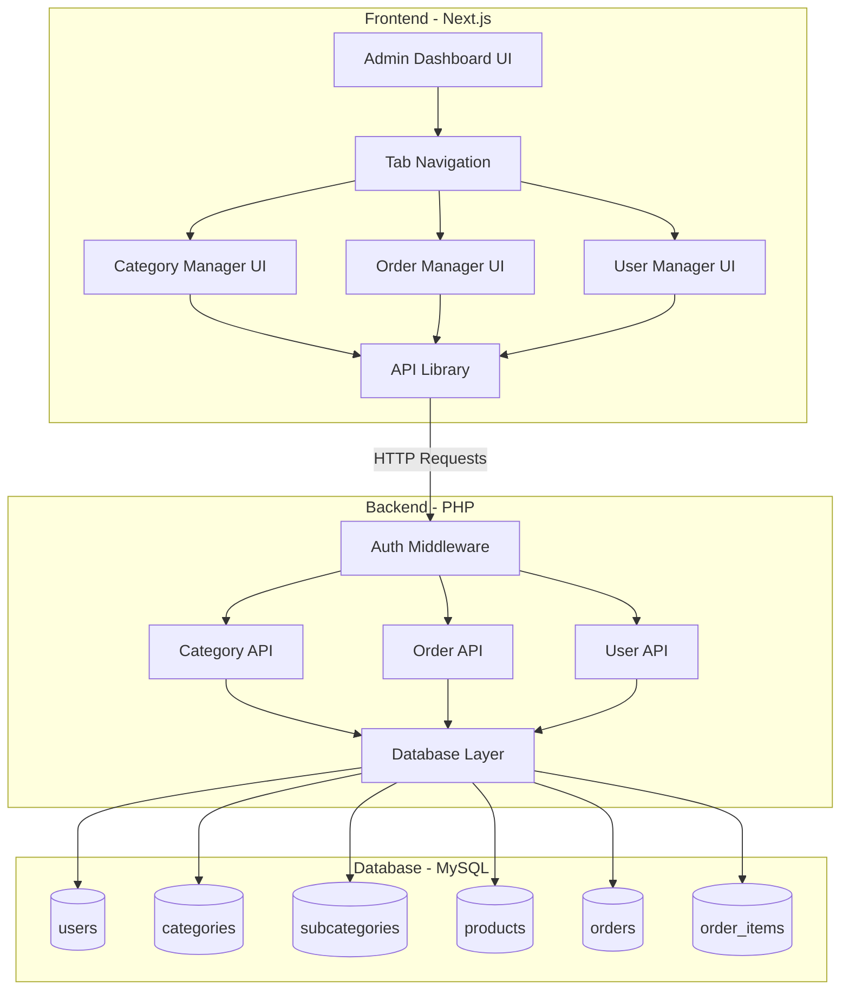
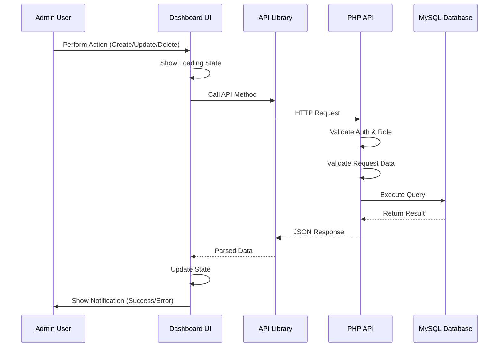

# Design Document: Admin Dashboard Features

## Overview

The admin dashboard features extend the existing Ijs Agroallied e-commerce platform with comprehensive management capabilities for categories, orders, and users. The design follows a client-server architecture where the Next.js frontend communicates with PHP backend APIs, with all data persisting to MySQL.

The implementation leverages the existing infrastructure:
- Frontend: Next.js 16 with TypeScript at `frontend/app/admin/page.tsx`
- Backend: PHP API endpoints following the pattern `backend/api/api/{resource}/{action}.php`
- Database: MySQL with existing tables (users, categories, subcategories, products, orders, order_items)
- API Library: Centralized API client at `frontend/lib/api.ts`

The design emphasizes:
- **Separation of concerns**: UI components, API layer, and database operations are clearly separated
- **Reusability**: Common patterns for CRUD operations across all management sections
- **User experience**: Consistent UI patterns with loading states, notifications, and responsive design
- **Security**: Role-based access control at both frontend and backend layers

## Architecture

### System Architecture



### Component Architecture

The frontend follows a component-based architecture with three main management sections:

1. **Category Manager**: Handles category and subcategory CRUD operations
2. **Order Manager**: Displays and manages orders with filtering and search
3. **User Manager**: Manages user accounts and roles

Each manager follows the same pattern:
- **List View**: Displays records in a table with search/filter controls
- **Create/Edit Modal**: Form for creating or editing records
- **Delete Confirmation**: Dialog for confirming destructive operations
- **API Integration**: Uses centralized API library for backend communication

### Data Flow



## Components and Interfaces

### Frontend Components

#### 1. AdminDashboard Component

Main container component that manages tab navigation and renders the appropriate manager.

```typescript
interface AdminDashboardProps {
  initialTab?: 'categories' | 'orders' | 'users';
}

interface AdminDashboardState {
  activeTab: 'categories' | 'orders' | 'users';
  user: User | null;
  isLoading: boolean;
}

component AdminDashboard {
  // Verify user is authenticated and has admin role
  // Render tab navigation
  // Render active manager component
  // Handle tab switching
}
```

#### 2. CategoryManager Component

Manages category and subcategory CRUD operations.

```typescript
interface Category {
  id: number;
  name: string;
  slug: string;
  description: string;
  image_url: string | null;
  created_at: string;
  subcategories?: Subcategory[];
}

interface Subcategory {
  id: number;
  category_id: number;
  name: string;
  slug: string;
  description: string;
  created_at: string;
}

interface CategoryManagerState {
  categories: Category[];
  isLoading: boolean;
  showModal: boolean;
  modalMode: 'create' | 'edit';
  selectedCategory: Category | null;
  showDeleteConfirm: boolean;
  deleteTarget: Category | null;
  searchQuery: string;
}

component CategoryManager {
  // Fetch and display categories with subcategories
  // Handle create/edit/delete operations
  // Show modal for forms
  // Show confirmation for delete
  // Handle image upload
  // Validate form data
}
```

#### 3. OrderManager Component

Displays and manages customer orders.

```typescript
interface Order {
  id: number;
  user_id: number;
  customer_name: string;
  customer_email: string;
  total_amount: number;
  status: 'pending' | 'processing' | 'shipped' | 'delivered' | 'cancelled';
  created_at: string;
  updated_at: string;
}

interface OrderItem {
  id: number;
  order_id: number;
  product_id: number;
  product_name: string;
  quantity: number;
  price: number;
  subtotal: number;
}

interface OrderManagerState {
  orders: Order[];
  isLoading: boolean;
  statusFilter: string;
  searchQuery: string;
  selectedOrder: Order | null;
  orderItems: OrderItem[];
  showDetailsModal: boolean;
}

component OrderManager {
  // Fetch and display orders
  // Filter by status
  // Search by customer name/email
  // Update order status
  // View order details and items
  // View customer order history
}
```

#### 4. UserManager Component

Manages user accounts and roles.

```typescript
interface User {
  id: number;
  name: string;
  email: string;
  role: 'admin' | 'user';
  created_at: string;
}

interface UserManagerState {
  users: User[];
  isLoading: boolean;
  roleFilter: string;
  searchQuery: string;
  selectedUser: User | null;
  userOrders: Order[];
  showDetailsModal: boolean;
  showDeleteConfirm: boolean;
  deleteTarget: User | null;
}

component UserManager {
  // Fetch and display users
  // Filter by role
  // Search by name/email
  // View user details and order history
  // Change user role
  // Delete user account
}
```

### Backend API Endpoints

All endpoints follow the pattern: `backend/api/api/{resource}/{action}.php`

#### Category Endpoints

```
GET    /api/api/categories/list.php
  Response: { success: true, data: Category[] }

POST   /api/api/categories/create.php
  Body: { name, slug, description, image_url }
  Response: { success: true, data: Category }

PUT    /api/api/categories/update.php
  Body: { id, name, slug, description, image_url }
  Response: { success: true, data: Category }

DELETE /api/api/categories/delete.php
  Body: { id }
  Response: { success: true, message: string }

GET    /api/api/categories/check-products.php?id={id}
  Response: { success: true, has_products: boolean, product_count: number }

POST   /api/api/subcategories/create.php
  Body: { category_id, name, slug, description }
  Response: { success: true, data: Subcategory }

PUT    /api/api/subcategories/update.php
  Body: { id, category_id, name, slug, description }
  Response: { success: true, data: Subcategory }

DELETE /api/api/subcategories/delete.php
  Body: { id }
  Response: { success: true, message: string }
```

#### Order Endpoints

```
GET    /api/api/orders/list.php?status={status}&search={query}
  Response: { success: true, data: Order[] }

GET    /api/api/orders/details.php?id={id}
  Response: { success: true, data: { order: Order, items: OrderItem[] } }

PUT    /api/api/orders/update-status.php
  Body: { id, status }
  Response: { success: true, data: Order }

GET    /api/api/orders/by-user.php?user_id={id}
  Response: { success: true, data: Order[] }
```

#### User Endpoints

```
GET    /api/api/users/list.php?role={role}&search={query}
  Response: { success: true, data: User[] }

GET    /api/api/users/details.php?id={id}
  Response: { success: true, data: User }

PUT    /api/api/users/update-role.php
  Body: { id, role }
  Response: { success: true, data: User }

DELETE /api/api/users/delete.php
  Body: { id }
  Response: { success: true, message: string }
```

### API Library Interface

The `frontend/lib/api.ts` library provides typed methods for all API calls:

```typescript
class AdminAPI {
  // Categories
  async getCategories(): Promise<Category[]>
  async createCategory(data: CategoryInput): Promise<Category>
  async updateCategory(id: number, data: CategoryInput): Promise<Category>
  async deleteCategory(id: number): Promise<void>
  async checkCategoryProducts(id: number): Promise<{ hasProducts: boolean, count: number }>
  
  // Subcategories
  async createSubcategory(data: SubcategoryInput): Promise<Subcategory>
  async updateSubcategory(id: number, data: SubcategoryInput): Promise<Subcategory>
  async deleteSubcategory(id: number): Promise<void>
  
  // Orders
  async getOrders(filters?: { status?: string, search?: string }): Promise<Order[]>
  async getOrderDetails(id: number): Promise<{ order: Order, items: OrderItem[] }>
  async updateOrderStatus(id: number, status: string): Promise<Order>
  async getUserOrders(userId: number): Promise<Order[]>
  
  // Users
  async getUsers(filters?: { role?: string, search?: string }): Promise<User[]>
  async getUserDetails(id: number): Promise<User>
  async updateUserRole(id: number, role: string): Promise<User>
  async deleteUser(id: number): Promise<void>
}
```

## Data Models

### Database Schema

The design uses existing database tables with the following structure:

#### users Table
```sql
CREATE TABLE users (
  id INT PRIMARY KEY AUTO_INCREMENT,
  name VARCHAR(255) NOT NULL,
  email VARCHAR(255) UNIQUE NOT NULL,
  password VARCHAR(255) NOT NULL,
  role ENUM('admin', 'user') DEFAULT 'user',
  created_at TIMESTAMP DEFAULT CURRENT_TIMESTAMP,
  updated_at TIMESTAMP DEFAULT CURRENT_TIMESTAMP ON UPDATE CURRENT_TIMESTAMP
);
```

#### categories Table
```sql
CREATE TABLE categories (
  id INT PRIMARY KEY AUTO_INCREMENT,
  name VARCHAR(255) NOT NULL,
  slug VARCHAR(255) UNIQUE NOT NULL,
  description TEXT,
  image_url VARCHAR(500),
  created_at TIMESTAMP DEFAULT CURRENT_TIMESTAMP,
  updated_at TIMESTAMP DEFAULT CURRENT_TIMESTAMP ON UPDATE CURRENT_TIMESTAMP
);
```

#### subcategories Table
```sql
CREATE TABLE subcategories (
  id INT PRIMARY KEY AUTO_INCREMENT,
  category_id INT NOT NULL,
  name VARCHAR(255) NOT NULL,
  slug VARCHAR(255) UNIQUE NOT NULL,
  description TEXT,
  created_at TIMESTAMP DEFAULT CURRENT_TIMESTAMP,
  updated_at TIMESTAMP DEFAULT CURRENT_TIMESTAMP ON UPDATE CURRENT_TIMESTAMP,
  FOREIGN KEY (category_id) REFERENCES categories(id) ON DELETE CASCADE
);
```

#### products Table
```sql
CREATE TABLE products (
  id INT PRIMARY KEY AUTO_INCREMENT,
  category_id INT,
  subcategory_id INT,
  name VARCHAR(255) NOT NULL,
  description TEXT,
  price DECIMAL(10, 2) NOT NULL,
  stock INT DEFAULT 0,
  image_url VARCHAR(500),
  created_at TIMESTAMP DEFAULT CURRENT_TIMESTAMP,
  updated_at TIMESTAMP DEFAULT CURRENT_TIMESTAMP ON UPDATE CURRENT_TIMESTAMP,
  FOREIGN KEY (category_id) REFERENCES categories(id) ON DELETE SET NULL,
  FOREIGN KEY (subcategory_id) REFERENCES subcategories(id) ON DELETE SET NULL
);
```

#### orders Table
```sql
CREATE TABLE orders (
  id INT PRIMARY KEY AUTO_INCREMENT,
  user_id INT NOT NULL,
  total_amount DECIMAL(10, 2) NOT NULL,
  status ENUM('pending', 'processing', 'shipped', 'delivered', 'cancelled') DEFAULT 'pending',
  created_at TIMESTAMP DEFAULT CURRENT_TIMESTAMP,
  updated_at TIMESTAMP DEFAULT CURRENT_TIMESTAMP ON UPDATE CURRENT_TIMESTAMP,
  FOREIGN KEY (user_id) REFERENCES users(id) ON DELETE CASCADE
);
```

#### order_items Table
```sql
CREATE TABLE order_items (
  id INT PRIMARY KEY AUTO_INCREMENT,
  order_id INT NOT NULL,
  product_id INT NOT NULL,
  quantity INT NOT NULL,
  price DECIMAL(10, 2) NOT NULL,
  created_at TIMESTAMP DEFAULT CURRENT_TIMESTAMP,
  FOREIGN KEY (order_id) REFERENCES orders(id) ON DELETE CASCADE,
  FOREIGN KEY (product_id) REFERENCES products(id) ON DELETE CASCADE
);
```

### Data Validation Rules

#### Category Validation
- **name**: Required, 1-255 characters, non-empty after trim
- **slug**: Required, 1-255 characters, lowercase, alphanumeric with hyphens, unique
- **description**: Optional, max 5000 characters
- **image_url**: Optional, valid URL format, max 500 characters

#### Subcategory Validation
- **category_id**: Required, must reference existing category
- **name**: Required, 1-255 characters, non-empty after trim
- **slug**: Required, 1-255 characters, lowercase, alphanumeric with hyphens, unique
- **description**: Optional, max 5000 characters

#### Order Validation
- **status**: Required, must be one of: pending, processing, shipped, delivered, cancelled
- **id**: Required for updates, must reference existing order

#### User Validation
- **role**: Required for role updates, must be 'admin' or 'user'
- **id**: Required for updates/deletes, must reference existing user
- **Cannot delete**: User with existing orders (enforce referential integrity)

## Correctness Properties

*A property is a characteristic or behavior that should hold true across all valid executions of a system—essentially, a formal statement about what the system should do. Properties serve as the bridge between human-readable specifications and machine-verifiable correctness guarantees.*

### Category Management Properties

**Property 1: Category creation persistence**
*For any* valid category data (name, slug, description, image_url), creating a category should result in the category being persisted to the database and the returned category should match the input data.
**Validates: Requirements 1.1**

**Property 2: Category update persistence**
*For any* existing category and any valid update data, updating the category should result in the database reflecting the changes and the returned category should match the updated data.
**Validates: Requirements 1.2**

**Property 3: Category deletion removes from database**
*For any* existing category, deleting the category should result in the category no longer existing in the database.
**Validates: Requirements 1.4**

**Property 4: Subcategory creation with parent relationship**
*For any* existing category and any valid subcategory data, creating a subcategory should result in the subcategory being persisted with the correct parent category relationship in the database.
**Validates: Requirements 1.5**

**Property 5: Category list hierarchical structure**
*For any* set of categories with subcategories, fetching the category list should return all categories with their subcategories properly nested in a hierarchical structure.
**Validates: Requirements 1.6**

**Property 6: Invalid category data rejection**
*For any* invalid category data (empty name, duplicate slug, invalid format), attempting to create or update a category should be rejected with appropriate validation errors.
**Validates: Requirements 1.7**

**Property 7: Image upload validation**
*For any* uploaded file, the system should validate file type and size before persisting, rejecting files that don't meet the criteria.
**Validates: Requirements 1.8**

### Order Management Properties

**Property 8: Order list completeness**
*For any* set of orders in the database, fetching the order list should return all orders with customer name, email, total amount, status, and dates present in each order.
**Validates: Requirements 2.1**

**Property 9: Order status filtering**
*For any* order status value and any set of orders, filtering by that status should return only orders matching the selected status.
**Validates: Requirements 2.2**

**Property 10: Order search by customer**
*For any* search query (customer name or email) and any set of orders, searching should return all orders where the customer name or email contains the search query.
**Validates: Requirements 2.3**

**Property 11: Order status update persistence**
*For any* existing order and any valid status value, updating the order status should result in the database reflecting the new status.
**Validates: Requirements 2.4**

**Property 12: Order details completeness**
*For any* order with items, fetching order details should return the order information along with all order items containing product name, quantity, price, and subtotal.
**Validates: Requirements 2.5**

**Property 13: Customer order history completeness and ordering**
*For any* customer with orders, fetching their order history should return all orders for that customer sorted by date in descending order (newest first).
**Validates: Requirements 2.6**

### User Management Properties

**Property 14: User list completeness**
*For any* set of users in the database, fetching the user list should return all users with name, email, role, and registration date present in each user.
**Validates: Requirements 3.1**

**Property 15: User role filtering**
*For any* role value (admin or user) and any set of users, filtering by that role should return only users matching the selected role.
**Validates: Requirements 3.2**

**Property 16: User details completeness**
*For any* user, fetching user details should return the complete user profile including name, email, role, registration date, and order history.
**Validates: Requirements 3.3**

**Property 17: User role update persistence**
*For any* existing user and any valid role value (admin or user), updating the user role should result in the database reflecting the new role.
**Validates: Requirements 3.4, 3.5**

**Property 18: User deletion removes from database**
*For any* existing user, deleting the user should result in the user no longer existing in the database.
**Validates: Requirements 3.7**

**Property 19: User search by name or email**
*For any* search query and any set of users, searching should return all users where the name or email contains the search query.
**Validates: Requirements 3.8**

### Error Handling and Validation Properties

**Property 20: API error responses**
*For any* API endpoint that encounters an error, the system should return an error response with a descriptive message and appropriate HTTP status code.
**Validates: Requirements 4.5**

**Property 21: Form validation errors**
*For any* form submission with invalid data, the system should return field-specific validation errors indicating which fields are invalid and why.
**Validates: Requirements 8.1**

**Property 22: Sensitive information protection**
*For any* error condition, error messages returned to the frontend should not contain sensitive information such as database structure, SQL queries, or credentials.
**Validates: Requirements 8.8**

### Authorization Properties

**Property 23: Admin role validation on API requests**
*For any* API request to admin endpoints, the system should validate that the requesting user has admin role before processing the request.
**Validates: Requirements 5.4**

**Property 24: Unauthorized request rejection**
*For any* API request to admin endpoints without valid admin credentials, the system should return a 401 (unauthenticated) or 403 (unauthorized) error response.
**Validates: Requirements 5.5**

### Filter Combination Property

**Property 25: Multiple filter AND logic**
*For any* combination of filters (status filter + search query, or role filter + search query), the system should return only records that match all applied filters using AND logic.
**Validates: Requirements 7.2**

## Error Handling

### Frontend Error Handling

The frontend implements comprehensive error handling at multiple levels:

#### API Call Error Handling
```typescript
try {
  setIsLoading(true);
  const result = await api.createCategory(formData);
  showNotification('success', 'Category created successfully');
  refreshCategories();
} catch (error) {
  if (error.response) {
    // Server responded with error
    if (error.response.status === 401 || error.response.status === 403) {
      showNotification('error', 'Unauthorized. Please log in again.');
      redirectToLogin();
    } else if (error.response.status === 422) {
      // Validation errors
      setValidationErrors(error.response.data.errors);
    } else {
      showNotification('error', error.response.data.message || 'Operation failed');
    }
  } else if (error.request) {
    // Request made but no response
    showNotification('error', 'Network error. Please check your connection.');
  } else {
    // Other errors
    showNotification('error', 'An unexpected error occurred');
  }
} finally {
  setIsLoading(false);
}
```

#### Validation Error Display
- Field-level errors displayed below each input
- Form-level errors displayed at the top of the form
- Errors cleared when user modifies the field

#### Network Error Handling
- Timeout errors: Display "Request timed out. Please try again."
- Connection errors: Display "Unable to connect. Please check your internet connection."
- Server errors (5xx): Display "Server error. Please try again later."

### Backend Error Handling

The backend implements consistent error handling across all endpoints:

#### Request Validation
```php
// Validate required fields
if (empty($data['name'])) {
    http_response_code(422);
    echo json_encode([
        'success' => false,
        'message' => 'Validation failed',
        'errors' => ['name' => 'Name is required']
    ]);
    exit;
}

// Validate data format
if (!preg_match('/^[a-z0-9-]+$/', $data['slug'])) {
    http_response_code(422);
    echo json_encode([
        'success' => false,
        'message' => 'Validation failed',
        'errors' => ['slug' => 'Slug must contain only lowercase letters, numbers, and hyphens']
    ]);
    exit;
}
```

#### Database Error Handling
```php
try {
    $db->beginTransaction();
    
    // Perform database operations
    $stmt = $db->prepare("INSERT INTO categories (name, slug, description, image_url) VALUES (?, ?, ?, ?)");
    $stmt->execute([$name, $slug, $description, $image_url]);
    
    $db->commit();
    
    http_response_code(201);
    echo json_encode([
        'success' => true,
        'data' => $category
    ]);
} catch (PDOException $e) {
    $db->rollBack();
    
    // Check for duplicate key error
    if ($e->getCode() == 23000) {
        http_response_code(422);
        echo json_encode([
            'success' => false,
            'message' => 'A category with this slug already exists'
        ]);
    } else {
        // Log detailed error for debugging
        error_log("Database error: " . $e->getMessage());
        
        // Return generic error to client
        http_response_code(500);
        echo json_encode([
            'success' => false,
            'message' => 'An error occurred while processing your request'
        ]);
    }
}
```

#### Authorization Error Handling
```php
// Check if user is authenticated
if (!isset($_SESSION['user_id'])) {
    http_response_code(401);
    echo json_encode([
        'success' => false,
        'message' => 'Authentication required'
    ]);
    exit;
}

// Check if user has admin role
if ($_SESSION['user_role'] !== 'admin') {
    http_response_code(403);
    echo json_encode([
        'success' => false,
        'message' => 'Admin access required'
    ]);
    exit;
}
```

### Error Response Format

All API endpoints return errors in a consistent format:

```json
{
  "success": false,
  "message": "Human-readable error message",
  "errors": {
    "field_name": "Field-specific error message"
  }
}
```

HTTP Status Codes:
- **400**: Bad request (malformed data)
- **401**: Unauthenticated (not logged in)
- **403**: Unauthorized (insufficient permissions)
- **404**: Resource not found
- **422**: Validation error (invalid data)
- **500**: Internal server error

## Testing Strategy

The testing strategy employs a dual approach combining unit tests for specific scenarios and property-based tests for universal correctness properties.

### Property-Based Testing

Property-based tests validate that universal properties hold across many randomly generated inputs. Each property from the Correctness Properties section will be implemented as a property-based test.

**Testing Library**: For TypeScript/JavaScript, we'll use **fast-check** for property-based testing.

**Configuration**:
- 20 iterations per property test (optimized for faster execution)
- Each test tagged with feature name and property number
- Tag format: `Feature: admin-dashboard-features, Property {N}: {property_text}`

**Example Property Test**:
```typescript
import fc from 'fast-check';

describe('Category Management Properties', () => {
  // Feature: admin-dashboard-features, Property 1: Category creation persistence
  it('should persist any valid category data to database', async () => {
    await fc.assert(
      fc.asyncProperty(
        fc.record({
          name: fc.string({ minLength: 1, maxLength: 255 }),
          slug: fc.stringOf(fc.constantFrom(...'abcdefghijklmnopqrstuvwxyz0123456789-'.split('')), { minLength: 1, maxLength: 255 }),
          description: fc.string({ maxLength: 5000 }),
          image_url: fc.option(fc.webUrl(), { nil: null })
        }),
        async (categoryData) => {
          // Create category via API
          const response = await api.createCategory(categoryData);
          
          // Verify it was created
          expect(response.success).toBe(true);
          expect(response.data.name).toBe(categoryData.name);
          expect(response.data.slug).toBe(categoryData.slug);
          
          // Verify it exists in database
          const dbCategory = await db.query('SELECT * FROM categories WHERE slug = ?', [categoryData.slug]);
          expect(dbCategory).toBeDefined();
          expect(dbCategory.name).toBe(categoryData.name);
          
          // Cleanup
          await db.query('DELETE FROM categories WHERE id = ?', [response.data.id]);
        }
      ),
      { numRuns: 100 }
    );
  });
});
```

### Unit Testing

Unit tests validate specific examples, edge cases, and error conditions that complement property-based tests.

**Testing Framework**: Jest for TypeScript/JavaScript, PHPUnit for PHP backend.

**Frontend Unit Tests**:
- Component rendering with different props
- User interaction handling (button clicks, form submissions)
- Modal open/close behavior
- Tab switching
- Loading state display
- Error notification display
- Confirmation dialog behavior

**Backend Unit Tests**:
- Authentication middleware
- Authorization checks
- Specific validation rules (empty name, duplicate slug)
- File upload validation (file type, size limits)
- Database transaction rollback on error
- Error response formatting
- Session expiration handling

**Example Unit Test**:
```typescript
describe('CategoryManager Component', () => {
  it('should display warning when deleting category with products', async () => {
    const categoryWithProducts = { id: 1, name: 'Test', slug: 'test', product_count: 5 };
    
    render(<CategoryManager />);
    
    // Mock API to return category with products
    jest.spyOn(api, 'checkCategoryProducts').mockResolvedValue({ hasProducts: true, count: 5 });
    
    // Click delete button
    const deleteButton = screen.getByTestId('delete-category-1');
    await userEvent.click(deleteButton);
    
    // Verify warning is displayed
    expect(screen.getByText(/This category has 5 products/i)).toBeInTheDocument();
    expect(screen.getByText(/Are you sure/i)).toBeInTheDocument();
  });
  
  it('should reject category creation with empty name', async () => {
    render(<CategoryManager />);
    
    // Open create modal
    await userEvent.click(screen.getByText('Create Category'));
    
    // Submit with empty name
    await userEvent.click(screen.getByText('Save'));
    
    // Verify validation error
    expect(screen.getByText(/Name is required/i)).toBeInTheDocument();
  });
});
```

### Integration Testing

Integration tests verify that components work together correctly:

- Frontend to backend API communication
- Database operations with real database (test database)
- Authentication flow
- Complete CRUD workflows
- Filter and search combinations
- Error propagation from backend to frontend

### Test Coverage Goals

- **Property-based tests**: Cover all 25 correctness properties
- **Unit tests**: Cover edge cases, error conditions, and UI interactions
- **Integration tests**: Cover complete user workflows
- **Code coverage**: Aim for 80%+ coverage on critical paths

### Testing Best Practices

1. **Isolation**: Each test should be independent and not rely on other tests
2. **Cleanup**: Always clean up test data after each test
3. **Mocking**: Mock external dependencies (API calls, database) in unit tests
4. **Real dependencies**: Use real database in integration tests (test database)
5. **Descriptive names**: Test names should clearly describe what is being tested
6. **Arrange-Act-Assert**: Follow AAA pattern for test structure
7. **Fast execution**: Unit tests should run quickly; property tests may take longer
8. **Continuous integration**: Run all tests on every commit
